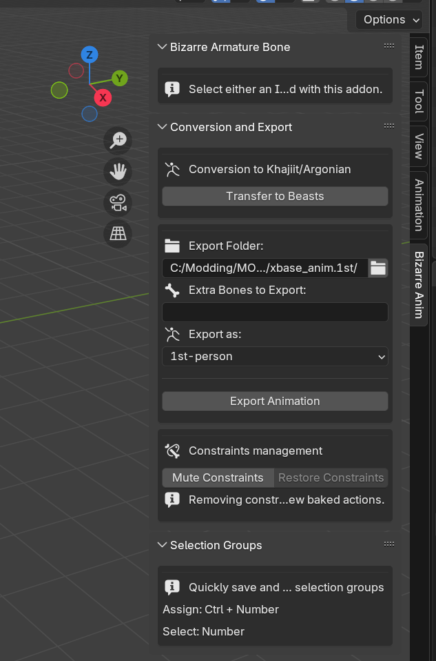
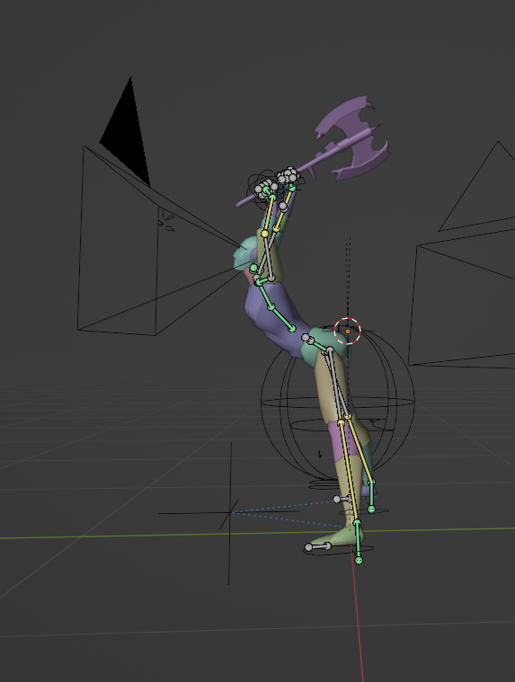
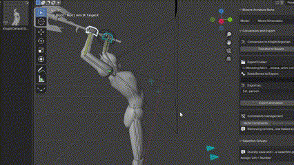
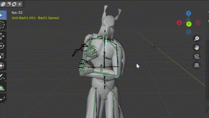

# Bizarre Morrowind Animation Utilities

Find it in the `Bizarre Anim` tab on the right side of the 3D Viewport.

Includes a set of tools simplifying retargeting (to beasts) and exporting (to 1st and 3rd person skeletons). 
It also integrates with a special rig contained in `BizarreMorrowindRig.blend`.
This is an IK rig with a set of [Cascadeur](https://cascadeur.com/)-inspired features, such as partial _`Auto-posing`_ and _`Mixed Kinematics`_ - an ability to pose limbs using Inverse Kinematics (`IK`) controllers while retaining the natural arcs of Forward Kinematics (`FK`) transitions between keyframes.

## Features

- **One-Click Animation Export**:
  - Bake, decimate, and export animations to `.nif`/`.kf` files.
  - Supports exporting animations for 1st and 3rd person armatures.

- **Beast Animation Retargeting**:
  - Retarget animations for beast armatures (e.g., Khajiit and Argonian).  

- **Constraint Management**:
  - Mute and restore constraints (`IK` and others) on armatures and their bones for a quick preview of baked or vanilla animations without constraints affecting motion.

- **Quick Bone Selection Groups**:
  - `RTS`-style selection group management. Select some bones and press `Ctrl + Number` to save the current selection into a bone selection group. Press `Number` to select a saved group. 

## Bizarre Rig

Found inside `BizarreMorrowindRig.blend`.
A mystical-magical IK rig that does everything for you and creates perfect animations in 2 clicks.

I might've slightly exaggerated just now.

Yet, it does contain some unusual features that you won't find in other rigs—features that, hopefully, will make it much easier and faster to create good-looking animations.

Bizarre rig-related features are contained inside the `Bizarre Armature Bone` section, which is active when a bone of the Bizarre rig is selected.

- **Autoposing**:
  Available on the hip, spine, and shoulder bones—if enabled, it adjusts those bones' rotations automatically when you move `IK` controllers (blue arm/feet controllers) around. You need to disable autoposing on a bone to be able to adjust it manually (There's a hotkey! `ctrl+a`); with a happy exception of a pelvis bone, which autopose setup is so simple that it can be both autoposed and manually adjusted at the same time.

- **Mixed Kinematics**:
  The kinematics mode dropdown is available when one of the `IK` controllers is selected. Mixed Kinematics is a hybrid of Blender's `IK` and `FK` modes. When you move a _`Mixed Kinematics`_ controller around, the corresponding limb functions as an `IK` limb, but when you release the controller, the limb returns to its regular constraint-less `FK` mode. Additionally, if you key a controller using the `I` shortcut in the 3D viewport, all the relevant limb and autopose bones will be keyed automatically.

See how above although IK controller transitions linearly between 2 points - it's corresponding limb moves in a natural ark - that's _`Mixed Kinematics`_!

This should be stressed again—both _`Mixed Kinematics`_ and _`Auto-posing`_ only do their magic when you drag `IK` controllers around! When you release them, the armature becomes a regular, unassuming, bog-standard Blender armature. Although all relevant bones are keyed automatically if you press the `I` shortcut, understanding the fact that those bones are indeed keyed might be useful in case you want to move them around in the `Action Editor`.

## Installation

0. Requires `Blender 4.3+` and [Blender Morrowind Plugin](https://github.com/Greatness7/io_scene_mw/releases). Be sure to update your [Blender Morrowind Plugin](https://github.com/Greatness7/io_scene_mw/releases) if you already have it installed.
1. Download the repository as an archive.
2. Install addon in Blender via `Edit > Preferences > Add-ons > Top-right arrow > Install from Disk`, and point it at the downloaded `.zip` archive.
3. Enable the addon if it wasn't enabled by default.
4. Enjoy.

Also try [Wiggle 2](https://github.com/shteeve3d/blender-wiggle-2)

