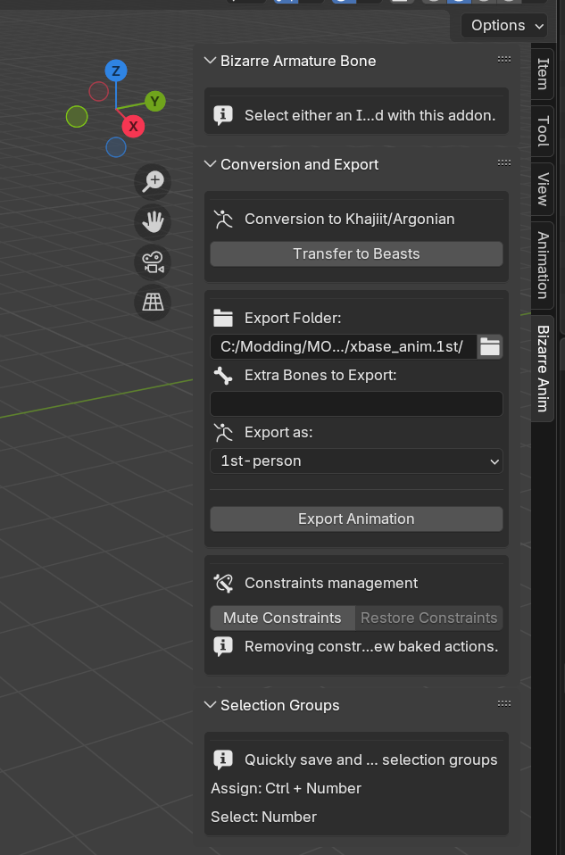
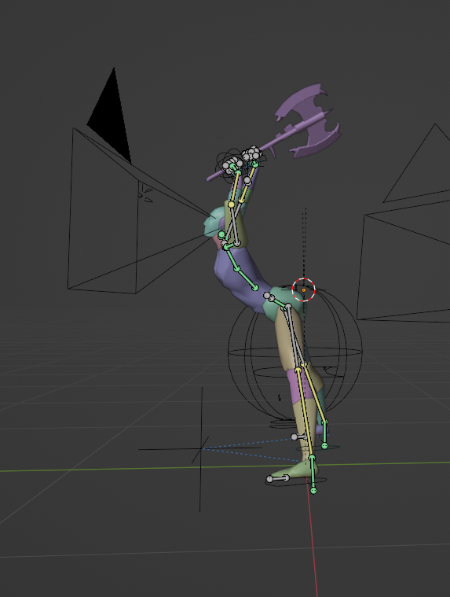
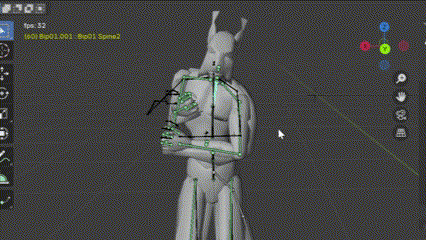
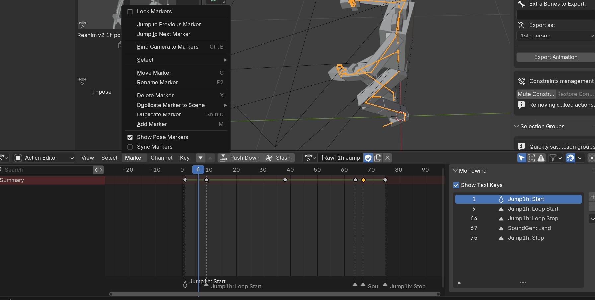

# Bizarre Morrowind Animation Utilities

Find it in the `Bizarre Anim` tab on the right side of the 3D Viewport.

A set of handy tools massively simplifying retargeting (to beasts) and exporting (to 1st and 3rd person skeletons) or morrowind animations. Seamlessly supports AutoRig Pro (ARP) and allows to export animations directly from the ARP rig without a need for manual rebaking (It's all automated under the hood).

## Morrowind animations are confusing, I'm scared, what do I do?!

There's a section at the very bottom of this readme that in short explains the procedure of Blender->Morrowind animations for OpenMW. With or without this blender addon. 

## Features

- **One-Click Animation Export**:
  - Bake, decimate, and export animations to `.nif`/`.kf` files.
  - Supports exporting animations for 1st and 3rd person armatures.

- **Beast Animation Retargeting**:
  - Retarget animations for beast armatures (e.g., Khajiit and Argonian).  

- **Constraint Management**:
  - Mute and restore constraints (`IK` and others) on armatures and their bones for a quick preview of baked or vanilla animations without constraints affecting motion.

- **Quick Bone Selection Groups**:
  - `RTS`-style selection group management. Select some bones and press `Ctrl + Number` to save the current selection into a bone selection group. Press `Number` to select a saved group. 

## Bizarre Rig (Legacy)

Found inside `BizarreMorrowindRig.blend`.
It was an experiment in creation of a mystical-magical IK rig with [Cascadeur](https://cascadeur.com/)-inspired features, such as partial spine auto-posing. It was an ambitious undertaking that, unfortunately, in practice, only worked sometimes and overall resulted in more time spend fighting this armature. I will recomment to use an AutoRig Pro morrowind armature floating online, e.g you can find it in "Morrowind Animation Overhaul Project" discord; or an actual Cascadeur morrowind rig that you can also find there. Bizarre Morrowind Animation Utilities fully supports AutoRig pro morrowind rig.
 

## Installation

0. *Requires `Blender 4.4+`* and [Blender Morrowind Plugin](https://github.com/Greatness7/io_scene_mw/releases). Be sure to update your [Blender Morrowind Plugin](https://github.com/Greatness7/io_scene_mw/releases) if you already have it installed.
1. Download the repository as an archive.
2. Install addon in Blender via `Edit > Preferences > Add-ons > Top-right arrow > Install from Disk`, and point it at the downloaded `.zip` archive.
3. Enable the addon if it wasn't enabled by default.
4. Enjoy.

Also try [Wiggle 2](https://github.com/shteeve3d/blender-wiggle-2)

## Morrowind animations still scare me, so what do I do?!

Don't fret! They are confusing and I might be too lazy to go into great depth but I will try to prime you with the basic knowledge necessary to export blender animations from blender (such as animations from [This collection](https://www.nexusmods.com/morrowind/mods/56734)) into OpenMW.
These instructions assume some basic Blender knowledge, but even without - I'm sure you'll be able to peace this together.

1. Install [Blender Morrowind Plugin](https://github.com/Greatness7/io_scene_mw/releases)

2. In action editor enable pose markers: `Action Editor -> Marker -> Show Pose Markers`. If you dont see a Morrowind panel on the right - press N with your mouse over the Action Editor section.

These marker define the name of you animation, its start and end point, as well as events happening within your animations. Usually markers follow a specific pattern: `groupname:textkey` - usually groupname is a name of an animation and textkeys are starting/ending point of the animation. E.g you might have an animation with the following markers:
`Sprint:Start`, `Sprint:StepSound`,`Sprint:Stop` - then in lua you will start the animation using the groupname `sprint`, startKey `start` and stopKey `stop` (your keys always become lowercase on OpenMW lua side for some reason). And you might also catch a `stepsound` key in the middle and play a sound. As you might've guessed now for a custom animation you might call your groupnames and textkeys whatever you want, as soon as you use same names in your code; but for animation replacers your groupnames and textkey names ofcourse should exactly match those of vanilla animations.

3. Now when you added your textkey - it's practically done - you only need to export the animation into an appropriate place. First person animation should go into `Animations/xbase/...` folder inside your mod folder or inside the `Data Files` of your game folder. 1st person animations should go into `Animations/xbase.1st/...`. Animation file names don't matter.

4. To export you can use `Bizarre Morrowind Utilities` or `Blender Morrowind Plugin`. If you use the former - add a `[Raw]` in front of the action name in Action Editor, and then use the plugin panel ui which you can see on a screenshot at the top of this page. `Bizarre Morrowind Utilities` uses `Blender Morrowind Plugin` but simplifies and optimises the process. If you want to know what `Blender Morrowind Plugin` does under the hood - you can export directly using it (it's not difficult at all) using the `File->Export`.

5. Additional info which you probably don't need:
number 3 of this instruction is only valid for OpenMW. Animations in the original game are usually kept in a humongous files containing all the animations related to this type of character. For example `Data Files/meshes/xbase.kf` contains ALL of the humanoid NPC animations! In the original engine if you want to override few of the NPC animations - you need to repackage them into this huge xbase.kf and replace the original one. OpenMW on the other hand - provides a way to override animations one-by-one. Every animation file put inside the `Data Files/Animations/basekfname/` - will be recognised and will override animations contained within that `basekfname.kf` file. It might be important to understand this connection between vanilla big base kf files and the names of folders inside `Animations`. For example imagine theres a vanilla set of animations contained within a `siltstrider.kf` file - let's say those are all the siltstrider animations in the game. Now to override only one or few of those without repackaging the whole kf - you will ensure that your animation in blender has markers exactly matching marker names of the original animation you want to override and then you export that animation as a kf file of whatever name inside a `Animations/siltstrider/...` folder. And then it *just works*.

## AI use disclaimer
ChatGPT and Qwen Code were used heavily to develop this addon.