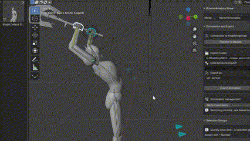

# Bizarre Morrowind Animation Utilities

Find it in the `Bizarre Anim` tab on the right side of the 3D Viewport.

Includes a set of tools simplifying retargeting (to beasts) and exporting (to 1st and 3rd person skeletons). 
It also integrates with a special rig contained in `BizarreMorrowindRig.blend`.
This is an IK rig with a set of [Cascadeur](https://cascadeur.com/)-inspired features, such as partial _`Auto-posing`_ and _`Mixed Kinematics`_ - an ability to pose limbs using Inverse Kinematics (`IK`) controllers while retaining the natural arcs of Forward Kinematics (`FK`) transitions between keyframes.

## Morrowind animations are confusing, I'm scared, what do I do?!

There's a section at the very bottom of this readme that in short explains the procedure of Blender->Morrowind animations for OpenMW. With or without this blender addon. 

## Features

- **One-Click Animation Export**:
  - Bake, decimate, and export animations to `.nif`/`.kf` files.
  - Supports exporting animations for 1st and 3rd person armatures.

- **Beast Animation Retargeting**:
  - Retarget animations for beast armatures (e.g., Khajiit and Argonian).  

- **Constraint Management**:
  - Mute and restore constraints (`IK` and others) on armatures and their bones for a quick preview of baked or vanilla animations without constraints affecting motion.

- **Quick Bone Selection Groups**:
  - `RTS`-style selection group management. Select some bones and press `Ctrl + Number` to save the current selection into a bone selection group. Press `Number` to select a saved group. 

## Bizarre Rig

Found inside `BizarreMorrowindRig.blend`.
A mystical-magical IK rig that does everything for you and creates perfect animations in 2 clicks.

I might've slightly exaggerated just now.

Yet, it does contain some unusual features that you won't find in other rigs—features that, hopefully, will make it much easier and faster to create good-looking animations.

Bizarre rig-related features are contained inside the `Bizarre Armature Bone` section, which is active when a bone of the Bizarre rig is selected.

- **Autoposing**:
  Available on the hip, spine, and shoulder bones—if enabled, it adjusts those bones' rotations automatically when you move `IK` controllers (blue arm/feet controllers) around. You need to disable autoposing on a bone to be able to adjust it manually (There's a hotkey! `ctrl+a`); with a happy exception of a pelvis bone, which autopose setup is so simple that it can be both autoposed and manually adjusted at the same time.

- **Mixed Kinematics**:
  The kinematics mode dropdown is available when one of the `IK` controllers is selected. Mixed Kinematics is a hybrid of Blender's `IK` and `FK` modes. When you move a _`Mixed Kinematics`_ controller around, the corresponding limb functions as an `IK` limb, but when you release the controller, the limb returns to its regular constraint-less `FK` mode. Additionally, if you key a controller using the `I` shortcut in the 3D viewport, all the relevant limb and autopose bones will be keyed automatically.

See how above although IK controller transitions linearly between 2 points - it's corresponding limb moves in a natural ark - that's _`Mixed Kinematics`_!

This should be stressed again—both _`Mixed Kinematics`_ and _`Auto-posing`_ only do their magic when you drag `IK` controllers around! When you release them, the armature becomes a regular, unassuming, bog-standard Blender armature. Although all relevant bones are keyed automatically if you press the `I` shortcut, understanding the fact that those bones are indeed keyed might be useful in case you want to move them around in the `Action Editor`.

## Installation

0. *Requires `Blender 4.3`* (At the moment works only in that version of Blender) and [Blender Morrowind Plugin](https://github.com/Greatness7/io_scene_mw/releases). Be sure to update your [Blender Morrowind Plugin](https://github.com/Greatness7/io_scene_mw/releases) if you already have it installed.
1. Download the repository as an archive.
2. Install addon in Blender via `Edit > Preferences > Add-ons > Top-right arrow > Install from Disk`, and point it at the downloaded `.zip` archive.
3. Enable the addon if it wasn't enabled by default.
4. Enjoy.

Also try [Wiggle 2](https://github.com/shteeve3d/blender-wiggle-2)

## Morrowind animations still scare me, so what do I do?!

Don't fret! They are confusing and I might be too lazy to go into great depth but I will try to prime you with the basic knowledge necessary to export blender animations from blender (such as animations from [This collection](https://www.nexusmods.com/morrowind/mods/56734)) into OpenMW.
These instructions assume some basic Blender knowledge, but even without - I'm sure you'll be able to peace this together.

1. Install [Blender Morrowind Plugin](https://github.com/Greatness7/io_scene_mw/releases)

2. In action editor enable pose markers: `Action Editor -> Marker -> Show Pose Markers`. If you dont see a Morrowind panel on the right - press N with your mouse over the Action Editor section.

These marker define the name of you animation, its start and end point, as well as events happening within your animations. Usually markers follow a specific pattern: `groupname:textkey` - usually groupname is a name of an animation and textkeys are starting/ending point of the animation. E.g you might have an animation with the following markers:
`Sprint:Start`, `Sprint:StepSound`,`Sprint:Stop` - then in lua you will start the animation using the groupname `sprint`, startKey `start` and stopKey `stop` (your keys always become lowercase on OpenMW lua side for some reason). And you might also catch a `stepsound` key in the middle and play a sound. As you might've guessed now for a custom animation you might call your groupnames and textkeys whatever you want, as soon as you use same names in your code; but for animation replacers your groupnames and textkey names ofcourse should exactly match those of vanilla animations.

3. Now when you added your textkey - it's practically done - you only need to export the animation into an appropriate place. First person animation should go into `Animations/xbase/...` folder inside your mod folder or inside the `Data Files` of your game folder. 1st person animations should go into `Animations/xbase.1st/...`. Animation file names don't matter.

4. To export you can use `Bizarre Morrowind Utilities` or `Blender Morrowind Plugin`. If you use the former - add a `[Raw]` in front of the action name in Action Editor, and then use the plugin panel ui which you can see on a screenshot at the top of this page. `Bizarre Morrowind Utilities` uses `Blender Morrowind Plugin` but simplifies and optimises the process. If you want to know what `Blender Morrowind Plugin` does under the hood - you can export directly using it (it's not difficult at all) using the `File->Export`.

5. Additional info which you probably don't need:
number 3 of this instruction is only valid for OpenMW. Animations in the original game are usually kept in a humongous files containing all the animations related to this type of character. For example `Data Files/meshes/xbase.kf` contains ALL of the humanoid NPC animations! In the original engine if you want to override few of the NPC animations - you need to repackage them into this huge xbase.kf and replace the original one. OpenMW on the other hand - provides a way to override animations one-by-one. Every animation file put inside the `Data Files/Animations/basekfname/` - will be recognised and will override animations contained within that `basekfname.kf` file. It might be important to understand this connection between vanilla big base kf files and the names of folders inside `Animations`. For example imagine theres a vanilla set of animations contained within a `siltstrider.kf` file - let's say those are all the siltstrider animations in the game. Now to override only one or few of those without repackaging the whole kf - you will ensure that your animation in blender has markers exactly matching marker names of the original animation you want to override and then you export that animation as a kf file of whatever name inside a `Animations/siltstrider/...` folder. And then it *just works*.

